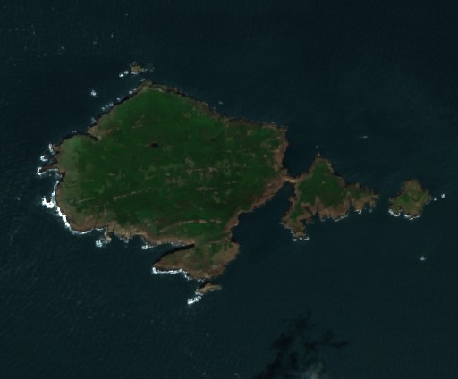
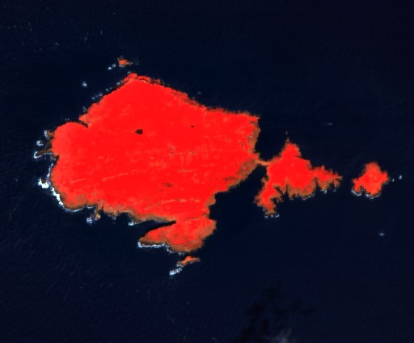

# Earth Observation Exploration

An exploration into Sentinel Hub and EO workflow services.

## True colour visualisation of Skomer Island in Pembrokeshire, Wales

## False colour (infra-red) visualisation of Skomer Island in Pembrokeshire, Wales

